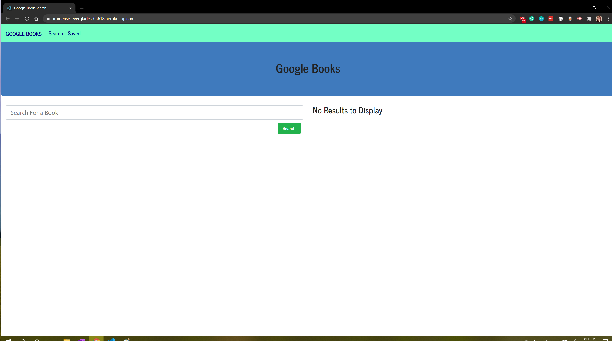

<!-- PROJECT SHIELDS -->

[![Contributors][contributors-shield]][contributors-url] [![Forks][forks-shield]][forks-url] [![Stargazers][stars-shield]][stars-url] [![Issues][issues-shield]][issues-url] [![LinkedIn][linkedin-shield]][linkedin-url]

 
<h3 align="center">Google Books</h3>
<p align="center">
This application allows a user to search the Google Books API and save books utilizing MongoDB.
<br />
<br />
<a href="https://immense-everglades-05618.herokuapp.com/">View Demo</a>
·
<a href="https://github.com/celupanow/googleBooks/issues">Report Bug</a>
·
<a href="https://github.com/celupanow/googleBooks/issues">Request Feature</a>

</p>

</p>
<!-- TABLE OF CONTENTS -->

## Table of Contents

* [About the Project](#about-the-project)
	* [Built With](#built-with)
* [Getting Started](#getting-started)
	* [Prerequisites](#prerequisites)
	* [Installation](#installation)
* [Roadmap](#roadmap)
* [Contact](#contact)
* [Acknowledgements](#acknowledgements)

 
<!-- ABOUT THE PROJECT -->

## About The Project


### Built With
* [React](https://reactjs.org/docs/getting-started.html)
* [MongoDB](https://www.mongodb.com/)
* [Node.js](https://nodejs.org)
* [Express](https://expressjs.com/)
* [Google Books API](https://developers.google.com/books)
* [react-router-dom](https://reactrouter.com/web/guides/quick-start)
* [Axios](https://www.npmjs.com/package/axios)
* [Mongoose](https://www.npmjs.com/package/mongoose)
* [concurrently](https://www.npmjs.com/package/concurrently)

<!-- GETTING STARTED -->

## Getting Started
To get a local copy up and running follow these simple steps.


### Prerequisites

You will need to have the lastest version of npm installed.
```sh
npm install npm@latest -g
```

You will also need MongoDB installed. 

The npm package concurrently will need to be installed globally.
```sh
npm install -g concurrently
```
  
### Installation

1. Clone the repo

```sh

git clone https://github.com/celupanow/googleBooks.git

```
2. Install the NPM packages
```sh
npm install
```
3. Run MongoDB in the command line
```sh
mongod
```
5. Run the React application in a new terminal
```sh
npm start
```
6. The browser should automatically open to localhost:3000

<!-- ROADMAP -->

## Roadmap

  

See the [open issues](https://github.com/celupanow/googleBooks/issues) for a list of proposed features (and known issues).

<!-- CONTACT -->

## Contact
Christina Lupanow - christina@christinalupanow.com
<p>
Project Link: [https://immense-everglades-05618.herokuapp.com/](https://immense-everglades-05618.herokuapp.com/)

<!-- ACKNOWLEDGEMENTS -->

## Acknowledgements
* [Heroku](https://heroku.com)


<!-- MARKDOWN LINKS & IMAGES -->

<!-- https://www.markdownguide.org/basic-syntax/#reference-style-links -->

[contributors-shield]: https://img.shields.io/github/contributors/celupanow/googleBooks.svg?style=flat-square

[contributors-url]: https://github.com/celupanow/googleBooks/graphs/contributors

[forks-shield]: https://img.shields.io/github/forks/celupanow/googleBooks.svg?style=flat-square

[forks-url]: https://github.com/celupanow/googleBooks/network/members

[stars-shield]: https://img.shields.io/github/stars/celupanow/googleBooks.svg?style=flat-square

[stars-url]: https://github.com/celupanow/googleBooks/stargazers

[issues-shield]: https://img.shields.io/github/issues/celupanow/googleBooks.svg?style=flat-square

[issues-url]: https://github.com/celupanow/googleBooks/issues

[license-shield]: https://img.shields.io/github/license/celupanow/googleBooks.svg?style=flat-square

[license-url]: https://github.com/celupanow/googleBooks/blob/master/LICENSE.txt

[linkedin-shield]: https://img.shields.io/badge/-LinkedIn-black.svg?style=flat-square&logo=linkedin&colorB=555

[linkedin-url]: https://linkedin.com/in/celupanow

[product-screenshot]: images/screenshot.png
<!--stackedit_data:
eyJoaXN0b3J5IjpbMTk5MzUyNTU5Myw3MDIyMjg0NDIsMTg5Nz
YxODU2MiwxMDU1MDcyMjA0XX0=
-->